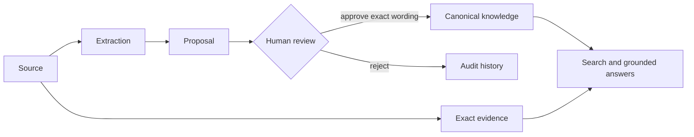

# Architecture

## Trust boundary

The application is a governed knowledge system, not a chat wrapper around a folder. Source text is untrusted data. It cannot approve itself, establish identity, change policy, or authorize a tool.

## Current components

- React/TypeScript web application.
- FastAPI API and domain services.
- SQLAlchemy persistence with SQLite locally and PostgreSQL in Compose.
- Deterministic extraction provider for offline reliability.
- Read-only stdio MCP server for compatible local agents.

## Invariants

1. Raw sources, proposals, and canonical knowledge use different tables.
2. Only `POST /api/v1/proposals/{id}/approve` can create canonical knowledge.
3. The approval references one proposal and creates a new canonical ID.
4. A proposal cannot be approved twice.
5. Grounded answers query only `canonical` knowledge.
6. Every citation points to the original source ID, title, and exact excerpt.
7. The deterministic extractor does not pretend to be AI inference.
8. Optional providers must not become required for reading, review, or export.
9. Agent tools cannot approve proposals or mutate canonical knowledge.

## Data model

- `sources`: original text, type, sensitivity, timestamp.
- `proposals`: extracted candidate, rationale, exact excerpt, review state.
- `knowledge`: approved wording, evidence, version, approval timestamp.
- `audit_events`: append-only domain event summary.

The next schema milestone adds immutable source versions, offsets, revision history, workspace grants, and content hashes before external agents receive write tools.

## Retrieval

The first release uses conservative keyword matching with simple token scoring. It returns an abstention when no approved item matches. This makes the trust workflow testable before introducing embeddings or rerankers.

Planned hybrid retrieval:

1. Authenticate and resolve the workspace.
2. Apply status, purpose, sensitivity, and temporal filters.
3. Combine full-text and local vector candidates.
4. Rerank only if evaluation demonstrates an improvement.
5. Expand permitted evidence and show conflicts.
6. Build a versioned context package.

## Provider boundary

Future generation, embedding, transcription, and Jev decision providers implement separate interfaces. Strict local mode must reject hosted requests before any network call. Provider failures cannot block access to existing knowledge.
