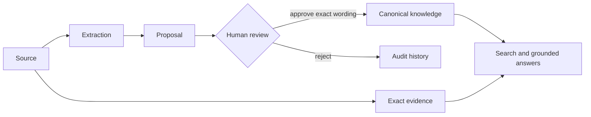

# Architecture

## Trust boundary

The application is a governed knowledge system, not a chat wrapper around a folder. Source text is untrusted data. It cannot approve itself, establish identity, change policy, or authorize a tool.

```mermaid
flowchart LR
    A[Source] --> B[Extraction]
    B --> C[Proposal]
    C --> D{Human review}
    D -->|approve exact wording| E[Canonical knowledge]
    D -->|reject| F[Audit history]
    E --> G[Search and grounded answers]
    A --> H[Exact evidence]
    H --> G
```

## Workspaces

A workspace is one company's Brain. It is the outermost boundary: every source,
proposal and approved item belongs to exactly one, and no query may read a row
without naming the workspace it is allowed to see.

- `workspaces`: stable company identity, unique slug, display name.
`workspace_grants`: which principal reaches which workspace, and with which
role (`owner`, `admin`, `member`). A principal is currently an opaque token,
not a person, because the local demo has no identity provider. That token is
never part of the shipped interface: the browser bundle is built without one and
the page asks for it at runtime, then sends it as `X-Brain-Token`. A token
compiled into the JavaScript would be readable by anyone who loaded the page, so
no `VITE_*` credential may exist.

Inside a workspace, `sensitivity` on the source is the second half of read
authority: `public` < `internal` < `private`, with a `member` ceiling of
`internal` and an `owner`/`admin` ceiling of `private`. Knowledge and proposals
carry no sensitivity column of their own and reach it through `source_id`, so a
child row can never disagree with its parent about how private it is. An
external retrieval engine's metadata filter narrows a query but does not
authorise it, so this check is applied on our read path, after the engine
answers.

`workspace_id` is stored on the root tables only — `sources`, `proposals`,
`knowledge`, `audit_events`. Child tables (`source_versions`, `source_spans`,
`proposal_evidence`, `knowledge_revisions`) are reached through their parent, so
a child can never disagree with its own parent about who owns it.

Reading is scoped by two things, never by one:

1. The workspace resolves the principal, so one company's token reads one
   company's rows and nothing else.
2. A record that exists in another workspace is reported as **404, not 403**,
   because confirming its existence would leak it.

Answers and search never fall back to another workspace: if the question has no
match in the caller's own workspace, the Brain abstains.

Exports are per workspace and carry the workspace id. A restore refuses a
backup that belongs to a different workspace rather than silently re-homing it
into the caller's.

## Current components

- React/TypeScript web application with modular CSS architecture.
- FastAPI API with 50+ endpoints covering sources, proposals, knowledge, workspaces, events, turns, proactivity, studio, routines, and usage.
- SQLAlchemy persistence with SQLite locally and PostgreSQL in Compose.
- Deterministic extraction provider for offline reliability.
- Engine abstraction (`engine.py`) with `DeterministicEngine` (local, always available) and `SupermemoryEngine` (hosted, optional). Engine failures degrade to empty, never block reads.
- Harness layer: event intake (`harness.py`), deterministic triage with policy enforcement (`triage.py`), and turn orchestration with budgets, steering, suspension, and cooperative cancellation (`turns.py`).
- Workspace isolation (`access.py`) with role-based access control, sensitivity scoping, and expiring/scoped tokens.
- Full-text search (`retrieval.py`): dialect-aware ranked search behind one interface — SQLite FTS5/BM25 over the `knowledge_fts` virtual table and PostgreSQL `to_tsvector`/`ts_rank_cd` over an expression GIN index (`knowledge_tsv_idx`). Terms are OR'd on both dialects so recall and abstention decisions match. ILIKE is the last-resort fallback so a read never hard-fails. The index carries `SEARCH_INDEX_VERSION`, persisted in `search_index_state`; a stale or unversioned index is rebuilt at boot instead of trusted. Synced after approval and supersession (SQLite only — the GIN index is engine-maintained).
- MCP HTTP adapter (`mcp_http.py`) exposing read-only tools over HTTP for remote agents. Every tool implementation takes an explicit `ReadScope` (`*_scoped` functions in `mcp_server.py`); the HTTP transport passes the resolved caller's scope, the stdio server passes the local owner scope.
- Intelligence Studio (`studio.py`, `studio_api.py`) with guided interview sessions and draft builder.
- Background worker (`worker.py`) for durable turn processing with lease-based claiming.
- Decision provider interface (`decision.py`) with deterministic and Jev shadow adapters.
- Critic pass (`critic.py`) for evidence gap detection and quality signals on proposals.
- Daily routines (`routines.py`) for scheduled digest delivery.
- Usage tracking (`usage.py`) for knowledge citation and reuse analytics.
- Held-out evaluation (`evaluation.py`) for Jev promotion decisions.
- Hermes messaging (`messaging.py`) for digest and alert delivery.
- Database migration support (`migrate.py`) for workspace, engine-link, and grant columns.
- Read-only stdio MCP server for compatible local agents.
- Single-image Dockerfile for Cloud Run deployment with Cloud Build configs.
- Self-hosted LLM proxy (`engine/`) for optional engine deployment.

## Invariants

1. Raw sources, proposals, and canonical knowledge use different tables.
2. Only `POST /api/v1/proposals/{id}/approve` can create canonical knowledge.
3. The approval references one proposal and creates a new canonical ID.
4. A proposal cannot be approved twice.
5. Grounded answers query only `canonical` knowledge.
6. Every citation points to the original source ID, title, and exact excerpt.
7. The deterministic extractor does not pretend to be AI inference.
8. Every source change creates a new version and hash; old evidence remains addressable.
9. Every canonical wording change creates a new knowledge revision.
10. Optional providers must not become required for reading, review, or export.
11. Agent tools cannot approve proposals or mutate canonical knowledge.
12. Every source, proposal and approved item belongs to exactly one workspace.
13. No read crosses a workspace boundary; another workspace's record is reported as not found, never as forbidden.
14. Grounded answers and canonical search never fall back to another workspace: they abstain instead.
15. A backup carries its workspace and cannot be restored into a different one.
16. Adding a workspace column never drops or rewrites existing provenance-bearing data.
17. No read returns a row above the caller's sensitivity ceiling. A record inside the caller's own workspace that they may not read is reported as not found, for the same reason as 13.
18. Every collection query is narrowed by a `ReadScope` carrying the caller's role, not by a bare `workspace_id` string.
19. Engine health is observed, not assumed. An engine that answers requests and accepts documents but derives nothing reports `degraded`, which is distinct from `unavailable`. Reachability is not usefulness: without this, a deployment with no model provider accepts every source, returns success, and produces an empty proposal queue with no signal that anything failed.
20. The readiness probe writes only to a dedicated healthcheck container, never a company's, and its result is cached because it sits on the overview request path.
21. The engine is an implementation, not a dependency. With nothing configured the product runs on deterministic local extraction and makes no network calls. A self-hosted engine needs no account or key from anyone, because it prints its own on first boot.
22. Engine-derived facts enter only as proposals, and each carries evidence — a source version at minimum — so an inference is never approved against a citation that does not exist.
23. Identity is an assertion from an identity provider, verified at the boundary before it becomes a row. Nothing in a request body, a query parameter, or model output can name a user or grant them access.
24. A human credential and a machine credential are not interchangeable. `users`/`workspace_members` describe people; `workspace_grants` describes opaque tokens. Neither may be substituted for the other, and an audit event says which class acted (`actor_kind`/`actor_id`).
25. Identity is optional. With no provider configured every read, review, and export works exactly as before on machine credentials alone (invariant 10).
26. A session secret is never stored — only its hash. A database read, an export, or a backup must not yield a usable credential.
27. Login grants identity, not reach. A session reaches a workspace only through `workspace_members`, resolved per request, so revoking a membership or deactivating a person takes effect immediately without touching an open session.
28. A request carries exactly one credential class. A session and a machine token travel in different headers and are never interchangeable; a request bearing both is refused rather than resolved by preference.

## Data model

- `workspaces`: one company, the outermost scoping boundary.
- `users`: a human identity, keyed on the identity provider's stable
  `(provider, provider_subject)` pair. Email is display metadata, never a key.
- `workspace_members`: a person's access to one workspace and the role they
  hold there — the human counterpart to a machine grant.
- `user_sessions`: one human sign-in. Stores only a SHA-256 hash of the session
  secret; the raw value exists solely in the login response. Proves WHO is
  asking and never grants reach on its own.
- `workspace_grants`: principal-to-workspace access and role. This is a MACHINE
  credential (an opaque token), deliberately not the same table as
  `workspace_members`.
- `sources`: stable source identity, original text, type, sensitivity, timestamp.
- `source_versions`: immutable content, SHA-256 hash, parser version, change note.
- `source_spans`: exact offsets, immutable excerpt, span hash, optional speaker.
- `proposals`: extracted candidate, rationale, exact excerpt, review state.
- `proposal_evidence`: exact source-version and span edge.
- `knowledge`: approved wording, evidence, version, approval timestamp.
- `knowledge_revisions`: append-only canonical wording history and provenance.
- `audit_events`: append-only domain event summary.
- `interview_sessions`: guided conversation metadata (topic, person, audience).
- `interview_questions`: ordinal questions with responses and extraction status.
- `drafts`: assembled output document (title, intent, audience).
- `draft_sections`: ordinal sections with content.
- `draft_citations`: section-to-knowledge links for source mapping.

`migrate.add_workspace_columns` adds the workspace columns to an existing
database. `Base.metadata.create_all` creates missing tables but never alters an
existing one, so a deployment upgrading from a single-workspace schema needs the
migration before it can query the new column. It is additive and idempotent: it
never drops or rewrites a column, because `sources` and `knowledge` carry
provenance.

## Retrieval

The first release uses conservative keyword matching with simple token scoring. It returns an abstention when no approved item matches. This makes the trust workflow testable before introducing embeddings or rerankers.

Ranked search has two engine implementations behind one contract, selected by dialect: SQLite FTS5 (BM25) and PostgreSQL `tsvector` (ts_rank_cd). Both are regression-tested against the same corpus and questions on every push (`test_dialect_parity.py`, `test_restart_gate.py`), asserting equivalent recall, abstention decisions, sensitivity behaviour, and citation provenance. Ranking order need not be byte-identical — the two engines use different ranking models — but safety behaviour must be. The restart gate runs the full capture → approve → restart → search → grounded answer → citation lifecycle across two real application lifespans, because the ranked index is only built in `lifespan` and a broken one is indistinguishable from an empty one in any single-boot test.

Every read is scoped twice — once by workspace, once by sensitivity — before it
reaches a result, an answer, an agent tool, or the interface. See
`supermemory-core-spec.md` for the retrieval engine this is being built
towards.

Planned hybrid retrieval:

1. Authenticate and resolve the workspace.
2. Apply status, purpose, sensitivity, and temporal filters.
3. Combine full-text and local vector candidates.
4. Rerank only if evaluation demonstrates an improvement.
5. Expand permitted evidence and show conflicts.
6. Build a versioned context package.

## Provider boundary

Future generation, embedding, transcription, and Jev decision providers implement separate interfaces. Strict local mode must reject hosted requests before any network call. Provider failures cannot block access to existing knowledge.
